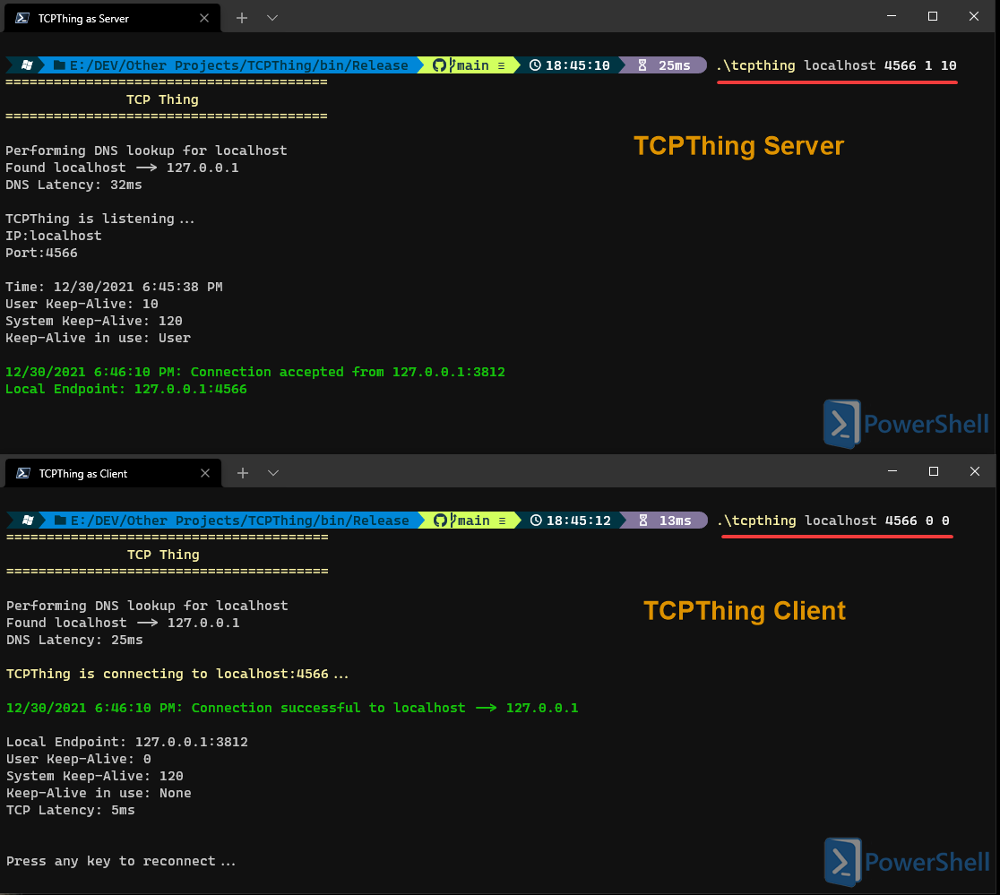

# TCPThing

This app is for TCP connection based testing. Currently only the TCP keep-alive socket option (in minutes) is configurable via comand line arguments. It needs some refactoring and cleanup but it's something I modify as needed since it's just a test tool for corner-case issues. I originally wrote this to use with Wireshark to test and demonstrate how TCP Keep-Alive options in windows actually behave on the wire.

You can run TCPThing as a client on one computer, and a server (listener) on another computer for example; or the same machine for that matter and connect client to server. Set server or client behavior by modifying the 3rd argument (1=server or 0=client). Or you can run a single instance as a client to connect to the endpoint of your choice. You could also run it as a server, then connnect from another endpoint using telnet. TCPThing will attempt to perform a DNS lookup if a hostname is provided instead of an IP address.

#### USAGE: **TCPThing &lt;IPAddress | Hostname&gt; &lt;TCPPort&gt; &lt;IsServer {0|1}&gt; [KeepAlive {0=SystemSetting | UserValue}]** 
  
  ### Examples  

  Create a listener on port 80: **TCPThing 127.0.0.1 80 1 0**  
  Create a client on port 80: **TCPThing 127.0.0.1 80 0 0**    
  Create a listener w/keep-alive on port 50000: **TCPThing 127.0.0.1 5000 1 1**  
  Create a client w/keep-alive of 1 minutes: **TCPThing 127.0.0.1 80 0 1**  
  Create a client w/keep-alive of 30 minutes: **TCPThing 127.0.0.1 80 0 30**  
  Create a server w/keep-alive of 4 minutes on port 8081: **TCPThing 127.0.0.1 8081 1 4**  
  Create a client on port 80 w/keep-alive using system default values: **TCPThing 127.0.0.1 80 0 0**     
   
  Acting as server and client on a single machine:  
   
     
      
   Acting as a client and creating a TCP connection to a website (handshake only, returns no data):     
  
     
Note: When running as a server on a remote machine, you must ensure the port used is open in the firewall. This app does not pass any data beyond TCP handshake packets. It's essentially a glorified TCP Handshake tool with the ability to set keep-alive time. See comments at the top of program.cs for additional usage information.

Requirements:
- Windows 8/10/11 with .NET 4.5 (port to .NET Core pending).

Build:   
- Clone to a local directory: **git clone https://github.com/karbomusic/TCPThing.git**
- Open in VS Studio 2019 and build or run.

Binaries:  
- You can download the latest binaries from the /bin/release folder.

ToDo: Add option to set TCPKeepAliveInterval
